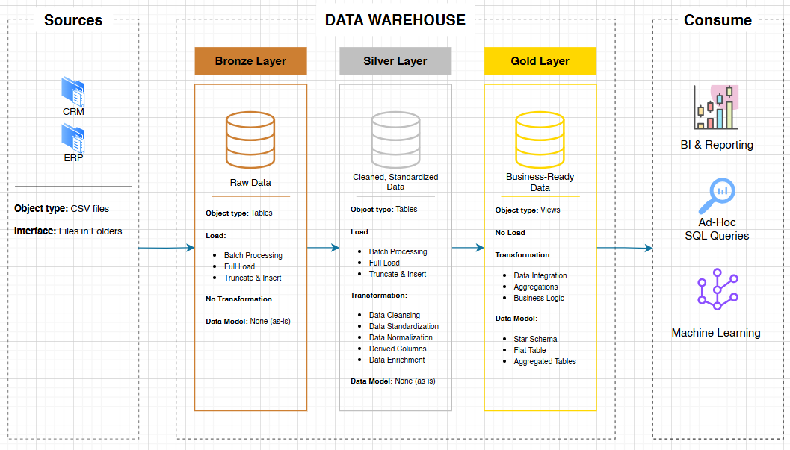

<h1>Data Warehouse and Analytics Project</h1>

<strong>Welcome to the Data Warehouse and Analytics Project repository!</strong> 🚀 
This project demonstrates a comprehensive data warehousing and analytics solution, from building a data warehouse to generating actionable insights. Designed as a portfolio project, it highlights industry best practices in data engineering and analytics.

<h2>Data Arhitecture</h2>
The data arhitecture for this project follows Medallion Architecture <strong>Bronze</strong>, <strong>Silver</strong> and <strong>Gold</strong> layers:  

<strong>Bronze Layer</strong>: Stores raw data as-is from the source systems. Data is ingested from CSV Files into SQL Server Database. 
<strong>Silver Layer</strong>: This layer includes data cleansing, standardization, and normalization processes to prepare data for analysis. 
<strong>Gold Layer</strong>: Houses business-ready data modeled into a star schema required for reporting and analytics.
